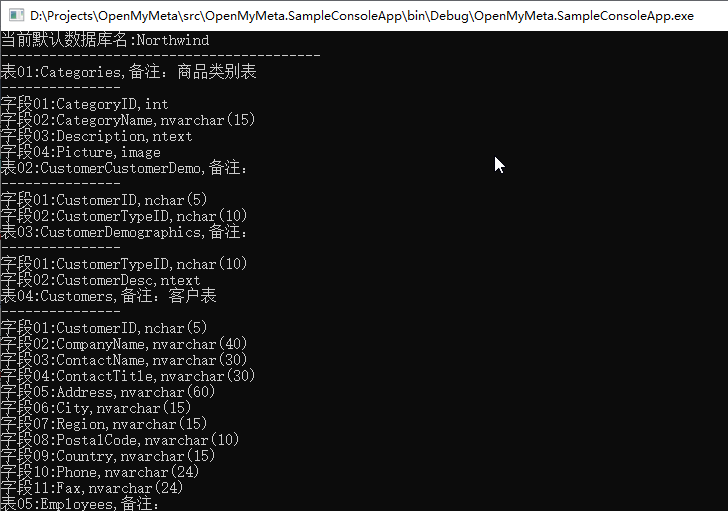

# OMeta-简单高效的关系数据库元数据信息提取方案
[](https://www.nuget.org/packages/OMeta/)
[](https://opensource.org/licenses/mit-license.html)

[文档](https://kiler398.github.io/OMeta/)

## 项目简介

OMeta 是一个关系型数据库元数据信息获取工具，把数据库->表->列，主键、外键、索引、默认值、备注、存储过程、函数、视图等抽象为对象，易于供代码生成工具生成代码使用。

1. 提供丰富的接口，能够获取常见的所有数据库元数据。能很好的获取表、索引、存储过程、函数、视图的定义。

2. 使用简单，只需要一个链接字符串并指定数据库类型连接到数据库即可获取该数据库的元数据信息。

3. 丰富的数据库类型支持，支持MSSQL Oracle MySQL PostgreSql Access SQLLite DB2 Firebird Interbase等主流数据库。

4. 有很强的语言生成支持扩展性，可以通过外置XML映射文件对各种编程语言（C# VB.NET Java）对数据字段类型提供映射操作。通过修改配置文件可以支持新的语言或者新的数据库字段。

## 项目起源

OMeta 并不是一个独立开发的原创项目，这个项目主要代码源自 [Mygeneration](https://sourceforge.net/p/mygeneration/)  项目的开源代码，该项目是一个优秀的开源的代码生成引擎工具，但是 [Mygeneration](https://sourceforge.net/p/mygeneration/)  主板本已经与2008年起停止更新了。本项目主要是延续 [Mygeneration](https://sourceforge.net/p/mygeneration/) 中的[MyMeta] 进行更新开发。

## 项目开发目标

老的[MyMeta]库是基于.Net 3.5开发的，里面也大量使用了COM+技术，并且也包含了一些现在来说不常见的数据库如 VistaDB，项目无法在新的.Net Core平台上跑起来，本身没有文档和单元测试，基于上述问题，OMeta有以下开发目标

1. 项目先期升级到.Net 4.6.1,同时慢慢剥离原有库对COM+技术的依赖，项目做好准备迁移到.Net Core 3.0。

2. 删除掉一些不常见数据库的支持如 VistaDB,让这个库更轻便。

3. 增加丰富的单元测试功能。

4. 增加完备的文档介绍。

5. 增加使用例子项目。


## 使用简介

下面是一个简单的使用例子

使用 [数据库脚本](src/DbScripts/Northwind_MSSQL.sql) 创建SqlServer数据库

```csharp
//初始化元数据类
dbRoot dbRoot = new dbRoot();
//连接到SqlServer数据库，注意必须使用oledb连接字符串
dbRoot.Connect(dbDriver.SQL, "Provider=sqloledb;Data Source=(local);Initial Catalog=Northwind;Integrated Security = SSPI; ");
//获取当前连接默认数据库
var database = dbRoot.DefaultDatabase;
//输出当前默认数据库名
Console.WriteLine("当前默认数据库名:"+database.Name);
Console.WriteLine("----------------------------------------");
//遍历循环当前数据库所有的表
int i = 1;
foreach (var table in database.Tables)
{
   //输出表名和备注
    Console.WriteLine("表"+ i.ToString("D2") + ":" + table.Name +",备注："+ table.Description);
    Console.WriteLine("---------------");
    int j = 1;
    //遍历循环表所有的字段
    foreach (var column in table.Columns)
    {
        //输出字段名和字段类型
        Console.Write("字段" + j.ToString("D2") + ":" + column.Name + "," + column.DataTypeNameComplete);
        Console.WriteLine("");
        j++;
    }
    i++;
}
```
运行代码输出以下结果




## 代码调试存在的问题

1. 项目涉及强名称编译，需要管理员方式启动VS。

